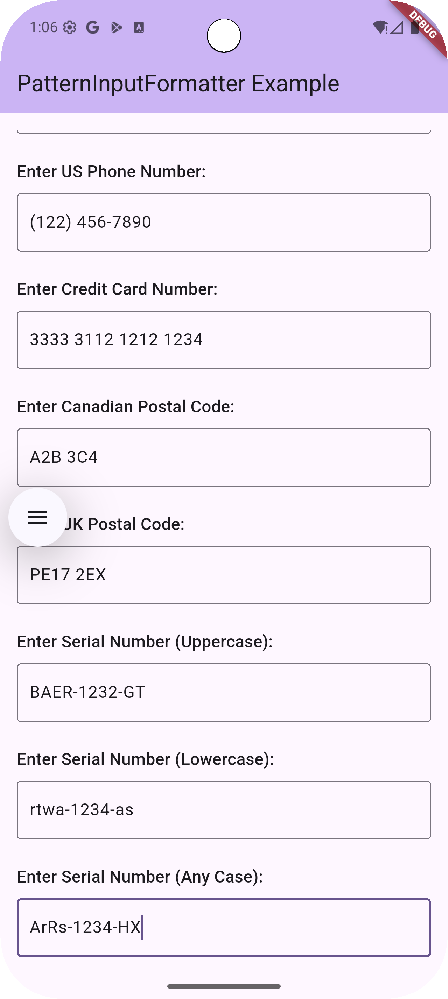

<!--
This README describes the package. If you publish this package to pub.dev,
this README's contents appear on the landing page for your package.

For information about how to write a good package README, see the guide for
[writing package pages](https://dart.dev/tools/pub/writing-package-pages).

For general information about developing packages, see the Dart guide for
[creating packages](https://dart.dev/guides/libraries/create-packages)
and the Flutter guide for
[developing packages and plugins](https://flutter.dev/to/develop-packages).
-->

# pattern_input_formatter

A Dart package that provides a custom `TextInputFormatter` for formatting user input in Flutter applications based on a given pattern. It allows users to enter text that is automatically formatted to match formats like phone numbers, dates, credit card numbers, and more.

This package aims to provide a user-friendly way to guide users to enter data in a predefined structure, improving data quality and user experience.

## Features

*   **Custom Patterns**: Define your desired input format (e.g., `(###) ###-####`, `dd/MM/yyyy`, `AA-####-BB`).
*   **Flexible Placeholders**: Supports `#` for digits and alphabetic characters (`a-z`, `A-Z`) as placeholders.
*   **Date and Time Validation**: Built-in validation for `date` and `time` inputs. It correctly handles leap years, days in a month, and valid time values, regardless of the pattern order (e.g., `dd/MM/yyyy` or `yyyy.MM.dd`).
*   **Configurable Letter Case**: Control whether alphabetic characters are converted to uppercase, lowercase, or remain as entered.
*   **Built-in Alphanumeric Filtering**: Automatically filters for letters and numbers, simplifying usage.
*   **Placeholder Characters**: Optionally specify a custom character for unfilled parts.
*   **Intelligent Cursor Management**: Positions the cursor intuitively after input or deletion for a smooth user experience.

## Screenshots

The following screenshots demonstrate the PatternInputFormatter in action with various input types:

| Date & Time Formats | Phone, Cards & Serial Numbers |
|:---:|:---:|
|  |  |

### Supported Format Examples

**Dates and Times:**
- Date formats: `dd/MM/yyyy`, `MM-dd-yy`, `yyyy.MM.dd`
- Time format: `HH:mm:ss`

**Communication & Finance:**
- US Phone Number: `(###) ###-####`
- Credit Card Number: `#### #### #### ####`

**Postal Codes:**
- Canadian: `A#A #A#`
- UK: `AA## #AA`

**Serial Numbers:**
- Uppercase: `AAAA-####-AA`
- Lowercase: `aaaa-####-aa`
- Any Case: `AaAa-####-Aa`

## Getting started

To use this package, add `pattern_input_formatter` as a dependency in your `pubspec.yaml` file.

```yaml
dependencies:
  flutter:
    sdk: flutter
  pattern_input_formatter: ^0.1.0
```

Then, run `flutter pub get` in your terminal.

## Usage

Import the package in your Dart file:

```dart
import 'package:pattern_input_formatter/pattern_input_formatter.dart';
```

Then, use the `PatternInputFormatter` in your `TextField`'s `inputFormatters` list. The formatter automatically handles alphanumeric input. For fields that should only accept numbers (like phone numbers or dates), you can add `FilteringTextInputFormatter.digitsOnly` to ensure the correct keyboard appears.

Here are a few examples:

**U.S. Phone Number `(###) ###-####`:**

```dart
TextField(
  decoration: const InputDecoration(
    hintText: '(###) ###-####',
    border: OutlineInputBorder(),
  ),
  keyboardType: TextInputType.phone,
  inputFormatters: [
    FilteringTextInputFormatter.digitsOnly, // Recommended for numeric-only keyboards
    PatternInputFormatter(pattern: '(###) ###-####'),
  ],
)
```

**Date (dd/MM/yyyy) with Validation:**

```dart
TextField(
  decoration: const InputDecoration(
    hintText: 'DD/MM/YYYY',
    border: OutlineInputBorder(),
  ),
  keyboardType: TextInputType.number,
  inputFormatters: [
    FilteringTextInputFormatter.digitsOnly,
    PatternInputFormatter(
      pattern: 'dd/MM/yyyy',
      inputType: PatternInputType.date, // Enable date validation
    ),
  ],
)
```

**Alphanumeric Postal Code (`A#A #A#`):**

```dart
TextField(
  decoration: const InputDecoration(
    hintText: 'A#A #A#',
    border: OutlineInputBorder(),
  ),
  keyboardType: TextInputType.text,
  inputFormatters: [
    PatternInputFormatter(pattern: 'A#A #A#', letterCase: LetterCase.upper),
  ],
)
```

### Date and Time Validation

To enhance data integrity, the formatter can validate user input for `date` and `time` formats. This is enabled by setting the `inputType` parameter.

When `inputType` is set to `PatternInputType.date`, the formatter will:
- Validate the month is between `01-12`.
- Validate the day is valid for the given month and year, including **leap years**.
- Support any pattern order (e.g., `dd/MM/yyyy`, `MM/dd/yyyy`, `yyyy.MM.dd`).
- Allow partial input (e.g., typing "31" for the day is allowed until the month is entered).

**Time (HH:mm:ss) with Validation:**

```dart
TextField(
  decoration: const InputDecoration(
    hintText: 'HH:MM:SS',
    border: OutlineInputBorder(),
  ),
  keyboardType: TextInputType.number,
  inputFormatters: [
    FilteringTextInputFormatter.digitsOnly,
    PatternInputFormatter(
      pattern: 'HH:mm:ss',
      inputType: PatternInputType.time, // Enable time validation
    ),
  ],
)
```

### Controlling Letter Case

You can control the case of alphabetic characters using the `letterCase` parameter.

**Uppercase Serial Number (`AAAA-####-AA`):**

```dart
TextField(
  decoration: const InputDecoration(
    hintText: 'AAAA-####-AA',
    border: OutlineInputBorder(),
  ),
  keyboardType: TextInputType.text,
  inputFormatters: [
    PatternInputFormatter(
      pattern: 'AAAA-####-AA',
      letterCase: LetterCase.upper, // This is the default
    ),
  ],
)
```

**Lowercase Serial Number (`aaaa-####-aa`):**

```dart
TextField(
  decoration: const InputDecoration(
    hintText: 'aaaa-####-aa',
    border: OutlineInputBorder(),
  ),
  keyboardType: TextInputType.text,
  inputFormatters: [
    PatternInputFormatter(
      pattern: 'aaaa-####-aa',
      letterCase: LetterCase.lower,
    ),
  ],
)
```

For a more complete example, please see the `/example` folder in this package.

## Additional information

### Contributing

Contributions are welcome! If you find any issues or have suggestions for improvements, please feel free to:

1.  **Open an issue**: Report bugs or suggest new features on the [issue tracker](https://github.com/paooxide/pattern_input_formatter/issues).
2.  **Submit a pull request**: If you'd like to contribute code, please fork the repository and submit a pull request with your changes.

When contributing, please try to:
*   Follow the existing code style.
*   Write tests for any new functionality or bug fixes.
*   Ensure your changes pass all existing tests.

### Reporting Issues

Please report any bugs or issues you find on the [GitHub Issues](https://github.com/paooxide/pattern_input_formatter/issues) page.

### License

This package is licensed under the MIT License. See the [LICENSE](LICENSE) file for details.
